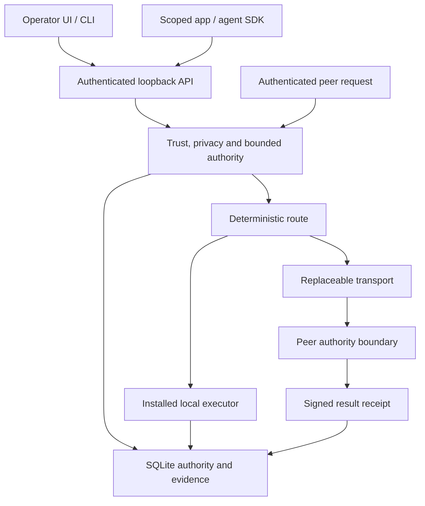

# Architecture

Each node is independently installable. There is no mandatory identity server,
directory, account, bootstrap host or external inference service. The attached
brief controls the candidate; ADR-001 records the implementation choices.

Dependency direction is `porch-core` to `porch-node` to `porch-cli`. Core imports
no networking runtime. Networking carries bounded signed frames through a
`Transport` trait with request, connect, disconnect and frame-budget operations.
The first implementation is rust-libp2p 0.56 with QUIC, TCP/Noise/Yamux, mDNS,
Identify, Ping and request-response. A new transport must preserve authenticated
peer identity and enforce the same frame/effect boundaries.

SQLite stores operator policy, peer trust, invitations, grants, replay nonces,
job reservations, pinned outbound routes, receipts, storage metadata, private
messages and a signed hash chain. Ciphertext lives separately in `vault/`;
partial uploads live in `transfers/`. Network observations are ephemeral. Identity
and API credential files remain local. Database ownership binds state to one
device ID. An unsupported future schema is refused rather than rewritten.

Remote job admission atomically consumes quota and reserves `(requester,id)`.
Two execution slots are the default; safely bounded operator configuration can
select 1–16. Overload refuses. A duplicate receives the
original receipt or a pending/uncertain refusal. Restart marks unfinished jobs
UNCERTAIN. The origin pins the first chosen executor and exact manifest before
sending: retries cannot silently switch providers and duplicate an effect.

The UI reads actual daemon state. Mock inference is a separately selected test
provider. Unknown GPU/VRAM, bandwidth and cost values remain unknown. Current
execution modes are SINGLE_NODE and REMOTE_NODE. There is no shell, arbitrary
plugin execution, WASM runtime, federation, relay or sharded model engine.

There is one active Porch per node. The owner signs invitations/membership;
pairwise operator trust controls direct effects. This candidate does not solve
distributed membership consensus or multi-community federation. Disconnection
does not erase durable authority. Expiring claims and effect-time checks bound
stale routing information; the provider is the final quota authority.

0.1.1 keeps protocol version 1 and the JSON/EOF peer format. BoundedJsonCodec
reads one byte beyond the allowed frame size before parsing, so a valid prefix
cannot conceal oversized padding. Dialing batches addresses into one attempt
pinned to the confirmed peer ID, with fallback to other addresses of that same
peer. Diagnostics select the actual connection used by RPC and bind RTT to its
connection ID. Signed addresses persist for trusted reconnection; expired
presence and closed connections remain separate from durable trust.

Qualification is an operator layer over existing effects, not a new authority
or transport. It signs fixed public probe evidence and a whitelist manifest;
the offline validator checks domains, file hashes, schema and receipt/run
bindings. Export never includes the database, private keys, tokens, arbitrary
prompts or arbitrary ledger text. Schema 2 migrates schema 1 only after a private
backup; future schemas and database-owner mismatches fail before migration.
Physical separation and WAN conditions remain corroboration requirements.
